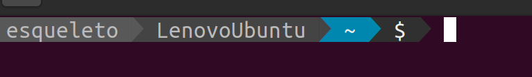

# ADB Commands

## Mirror the phone
```
> adb shell screenrecord --output-format=h264 - | mplayer -framedrop -fps 6000 -cache 512 -demuxer h264es -
```

# When configure a new computer: 
* Install neofetch

* To install PowerLine, follow the guide: https://www.ricalo.com/blog/install-powerline-ubuntu/ 



=> use this guide: https://medium.com/earlybyte/powerline-for-bash-6d3dd004f6fc

# Useful commands
## Run redis instance with modules
* This command load the reJSON module but other can be loaded (see: https://hub.docker.com/r/redislabs/redismod)
* Uses persistent data

```
	sudo docker run 
		--detach \ 
		-p 6379:6379 \
		-v /home/user/data:/data \
		redislabs/redismod \
		--loadmodule /usr/lib/redis/modules/rejson.so \
		--dir /data
```


# Install Third Party Codecs   
-> Ubuntu:   
```sudo apt install ubuntu-restricted-extras```   
-> Manjaro:    
```sudo pacman -S a52dec faac faad2 flac jasper lame libdca libdv libmad libmpeg2 libtheora libvorbis libxv opus wavpack x264 xvidcore```   

# Install 32-Bit NVIDIA driver
-> Ubuntu:   
``` sudo apt-get install libnvidia-gl-390:i386 ```   
Instead of 390, put your driver version. 
Use the command ```nvidia-smi``` to reveal NVIDIA driver version

# Start and Stop GoPRO WebCam service
```> sudo systemctl start gopro_webcam.service ```   
```> sudo systemctl stop gopro_webcam.service ```   

## Read the log of the service
```> sudo journalctl -u gopro_webcam -f ```
